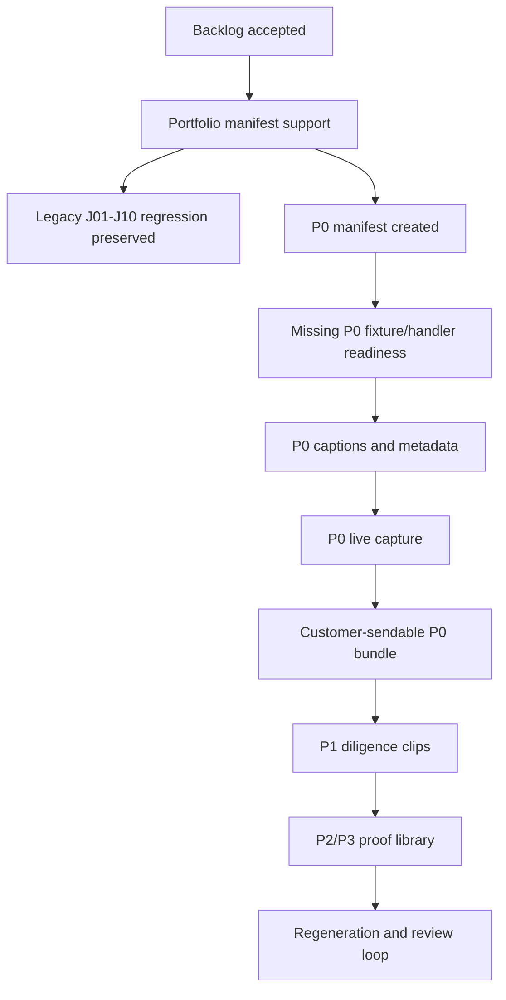

# Demo Video Implementation Roadmap V3

Generated: 2026-06-16

Instruction: `Max` / `ENGINE_MIX_V2_V3`

Scope: phased implementation plan only. This document does not implement product UI, schema, seed data, screencast manifests or workflow handlers.

Source artifacts:

- `docs/v3/DEMO_JOURNEY_UNIVERSE_AUDIT_V3.md`
- `docs/v3/DEMO_JOURNEY_OPPORTUNITY_BACKLOG_V3.json`
- `docs/v3/DEMO_SCREENCAST_EXPANSION_RECOMMENDATION_V3.md`
- `docs/v3/journeys.screencast.v3.json`
- `scripts/screencast/lib/journey-fixtures.ts`
- `scripts/screencast/lib/types.ts`
- `scripts/screencast/lib/runner.ts`
- `app/api/demo-workflow/route.ts`
- `docs/v3/IMPLEMENTATION_QA_REPORT.md`

## Executive Verdict

Do not start by creating more videos. Start by turning the current screencast system into a portfolio-capable demo-video production system, then refactor `J01-J10` into the P0 customer narrative, add the missing P0 trust surfaces, and only then produce polished customer-sendable MP4s.

## Target State

The target is a sendable AlphaVest demo-video library with three layers:

| Layer | Purpose | Output |
| --- | --- | --- |
| P0 Primary Demo | Customer-facing, executive-safe, polished narrative. | About 12 polished clips plus 5/15/30 minute playlist scripts. |
| P1 Trust Proof | Diligence appendix for compliance, investors and operations. | Selected proof clips plus technical speaker notes. |
| P2/P3 Proof Library | QA-first negative, denial, route, state and permission proof. | Tests, matrices, screenshots, run logs and only selected videos. |

Customer-sendable means:

- no visible spec panels, route labels, filenames, annotation rails or dev notes as app UI,
- deterministic demo data only,
- burned-in captions or matching caption files,
- a clean current-reality label in metadata/speaker notes,
- no claim of real auth, final advice, real binary file generation or production-grade authorization,
- every important visible claim has a proof path to handler, fixture, test, run log or QA report.

## Facts / Assumptions / Interpretations / Moves

### Facts

| Fact | Implementation impact |
| --- | --- |
| Current `J01-J10` pass live screencast QA with zero warnings/errors and burned-in captions. | Preserve the existing manifest as a regression baseline until the new portfolio passes. |
| `J02-J09` have implemented demo workflow actions and API/test proof. | Refactor these into P0/P1/P2 without throwing away the existing handlers. |
| `J10` has fixture expectations but still relies on generic action/audit behavior for policy/security claims. | Use J10 as a policy frame unless dedicated `j10.*` handlers are implemented. |
| The runner currently reads `docs/v3/journeys.screencast.v3.json` as a hard-coded manifest. | Manifest selection/refactoring is an enabling phase before serious expansion. |
| The backlog now contains 51 canonical candidates: 12 P0, 16 P1, 18 P2, 5 P3. | Use the backlog as the portfolio contract, not as an instruction to video everything. |

### Assumptions

| Assumption | Guardrail |
| --- | --- |
| Existing J01-J10 assets remain useful as legacy/regression proof. | Keep them until P0 has a clean full run. |
| P0 clips should be customer-sendable earlier than P1/P2. | Do not block P0 on every diligence appendix. |
| Some missing surfaces are route/static first, not persisted workflow first. | Label reality honestly and add handlers only when the video claim requires execution proof. |

### Interpretations

| Interpretation | Consequence |
| --- | --- |
| The core work is not video production; it is proof-aligned narrative refactoring. | Each phase must include manifest, fixture, handler, caption and QA gates. |
| Existing combined journeys hide important branch differences. | Split J01, J02 and J03 in the demo portfolio even if the legacy journey remains. |
| Exhaustive coverage is not a video format. | Keep P3 as matrices/reports instead of MP4s. |

### Recommended Moves

| Move | Why |
| --- | --- |
| Create portfolio-aware screencast manifests. | Enables legacy, P0, P1 and P2 assets to coexist without breaking J01-J10. |
| Refactor current journeys by cloning/splitting rather than renaming in place. | Preserves working automation while new clips mature. |
| Add missing P0 routes before recording final customer MP4s. | Onboarding, evidence vault and mobile/client-safe states close the biggest story gaps. |
| Promote P2 only when a stakeholder needs the visual proof. | Avoids a bloated 100-video library. |

## Phase Overview

| Phase | Name | Primary Outcome | Video Output |
| --- | --- | --- | --- |
| 0 | Freeze and Portfolio Contract | Accepted demo target, naming and proof policy. | None |
| 1 | Screencast Architecture Refactor | Manifest layers, metadata and run tooling can handle portfolios. | None |
| 2 | Legacy Journey Refactor | J01-J10 mapped into P0/P1/P2 without losing regression coverage. | Draft P0 manifest |
| 3 | Missing P0 Readiness | Onboarding, evidence vault and customer-safe mobile surfaces have fixtures and proof labels. | P0 dry-run candidates |
| 4 | P0 Customer Video Production | 12 customer-sendable primary clips plus playlists. | P0 final MP4 bundle |
| 5 | P1 Trust Proof Expansion | High-value diligence clips and appendix proof. | Selected P1 clips |
| 6 | P2/P3 Proof Library | Negative cases and exhaustive proof as QA-first assets. | Selected P2 clips only |
| 7 | Packaging and Maintenance | Regeneration, delivery bundle and release checklist. | Customer package |

## Phase 0 - Freeze And Portfolio Contract

Goal: prevent the team from building "more videos" before agreeing what kind of library is being built.

Task clusters:

- Approve the P0/P1/P2/P3 portfolio model as the planning contract.
- Decide the customer-sendable caption tone and language strategy.
- Decide whether final clips are English-only, German-only or bilingual metadata with English videos.
- Freeze overclaim rules for video captions, speaker notes and file names.
- Define the "video-worthy" gate: route sequence, fixture, current-reality label, proof path, caveat, QA command.

Acceptance gate:

- A short decision note exists in `docs/v3/`.
- `DEMO_JOURNEY_OPPORTUNITY_BACKLOG_V3.json` remains the canonical candidate source.
- No new video is recorded before its candidate has a proof label and caveat.

## Phase 1 - Screencast Architecture Refactor

Goal: make the screencast system portfolio-capable before expanding content.

Task clusters:

- Add support for selecting a screencast definition file rather than relying only on the hard-coded `docs/v3/journeys.screencast.v3.json`.
- Preserve `journeys.screencast.v3.json` as the legacy J01-J10 regression manifest.
- Introduce planned manifest layers, for example:
  - `journeys.screencast.p0.v3.json`
  - `journeys.screencast.p1.v3.json`
  - optional `journeys.screencast.p2.v3.json` for promoted negative clips only
- Extend or add metadata records for captions, speaker notes, proof labels, caveats and current-reality labels.
- Ensure run outputs include manifest identity, portfolio layer, journey ID and proof level.

Refactor decision:

- Do not rename `J01-J10` in place.
- Clone/split them into P0 candidates while keeping legacy runs reproducible.
- Add a compatibility map from legacy journey IDs to portfolio candidate IDs.

Acceptance gate:

- Legacy J01-J10 still validates.
- New manifest selection validates at dry-run level.
- Run logs show which manifest and portfolio layer produced each video.

Suggested verification:

- `pnpm typecheck`
- `pnpm screencast:dry-run`
- dry-run for the new P0 manifest once created

## Phase 2 - Legacy Journey Refactor Into P0

Goal: turn the useful parts of J01-J10 into the customer narrative without breaking existing proof.

Refactor map:

| Existing | Refactor action | Target |
| --- | --- | --- |
| J01 Signal -> Advisor | Split into signal/request-data/routing and advisor approval without release. | P0-06, P0-07 |
| J02 Compliance Release/Block | Split request/block and release into separate clips. | P0-08, P0-09 |
| J03 Client Decision/Evidence | Keep accept path; split defer/reject/request-info into P2; add evidence vault entry. | P0-10, P1-01, P1-15, P2-09, P2-10 |
| J04 Document Upload | Keep as proof path; combine narratively with profile intake. | P0-04, P1-10, P2-05, P2-06 |
| J05 Entity/Wealth/Action | Keep main structure journey; split blocked ready/request-info as proof branches. | P0-05, P2-16, P2-17 |
| J06 Tenant Onboarding | Keep tenant setup; extend with invited-user onboarding. | P0-02, P0-03 |
| J07 Governance/Audit | Keep governance journey; split deny/revoke/audit-export as appendix/negative proof. | P0-12, P1-13, P1-14, P2-13 |
| J08 Export/Redaction | Keep success path; split export denied/share expired. | P0-11, P1-11, P2-11, P2-12 |
| J09 Profile/Family | Keep as intake proof; combine narratively with documents and mobile. | P0-04, P1-16 |
| J10 Platform Policy | Keep as intro frame with caveat; upgrade only if dedicated handlers are added. | P0-01, P1-12 |

Task clusters:

- Build the P0 manifest from cloned/split legacy journeys.
- Keep each P0 clip shorter and sharper than the original combined journey.
- Update captions/notes so every clip has one thesis and one proof claim.
- Remove or relocate branch paths that weaken the primary narrative.
- Keep P2 alternatives as QA/proof candidates, not mainline P0 clips.

Acceptance gate:

- Legacy J01-J10 still passes.
- P0 manifest has 12 candidate entries.
- Each P0 candidate has route sequence, role, tenant, fixture refs, expected proof and caveat.

## Phase 3 - Missing P0 Readiness

Goal: close the highest-signal gaps before producing final customer videos.

Task clusters:

- P0-03: add user onboarding/identity/consent/role-confirmation fixture and manifest path.
- P0-10: add `/evidence` vault entry before `/evidence/demo`.
- P1-16 or optional P0 insert: add `/mobile` safe next-step / blocked recommendation proof.
- P0-01/J10: either add dedicated `j10.*` handlers or explicitly downgrade it to "policy frame, not persisted policy mutation."
- Decide which missing surfaces are true P0 and which stay P1.

Implementation posture:

- Do not introduce real auth.
- Do not imply MFA is production-backed.
- Use demo identity/consent state and explicit no-real-auth metadata.
- Only add handlers where the video claim requires executable proof.

Acceptance gate:

- P0 has no route/story gap that undermines "Mandantendaten -> Docs -> Signal -> Advisor -> Compliance -> Client Decision -> Evidence -> Export/Audit."
- P0 caveats are present in metadata/speaker notes.
- Any P0 route-only/static surface is labeled honestly.

Suggested verification:

- `pnpm typecheck`
- `pnpm test:workflow-api`
- `pnpm test:permissions`
- `pnpm visual:contract`
- P0 manifest dry-run

## Phase 4 - P0 Customer Video Production

Goal: produce the first sendable customer demo bundle.

Task clusters:

- Record 12 P0 clips in human-demo speed.
- Render MP4s with burned-in captions.
- Generate transcript, storyboard, metadata and run log for every P0 clip.
- Create 5-minute, 15-minute and 30-minute playlist scripts from the same clips.
- Add a customer-facing index document with clip order, audience fit and safe one-line description.

P0 recommended order:

1. P0-01 Policy/no-advice baseline.
2. P0-02 Tenant setup.
3. P0-03 User onboarding/consent.
4. P0-04 Profile/docs/data quality.
5. P0-05 Entities/wealth/action readiness.
6. P0-06 Signal request/routing.
7. P0-07 Advisor approval without release.
8. P0-08 Compliance request/block.
9. P0-09 Compliance release.
10. P0-10 Client decision and evidence.
11. P0-11 Export/redaction/download/share.
12. P0-12 Governance access/audit.

Acceptance gate:

- Each P0 clip has status `passed`.
- No click warnings, fallback warnings or missing expected text.
- Captions are present and customer-safe.
- Metadata contains caveat, proof path and current reality label.
- A reviewer can send the bundle without accidentally claiming real auth, final advice or production-grade compliance.

Suggested verification:

- P0 dry-run.
- P0 live run at `human-demo`.
- MP4 render check.
- `pnpm visual:contract`.
- Spot-check screenshots and captions.

## Phase 5 - P1 Trust Proof Expansion

Goal: add the diligence appendix that makes the customer videos defensible.

Task clusters:

- Add high-value P1 clips first:
  - P1-01 evidence vault browse.
  - P1-15 evidence download audited.
  - P1-16 mobile next-step blocked recommendation.
  - P1-02 communication path selection.
  - P1-03 call trigger matrix.
  - P1-13 permission matrix / second confirmation.
- Add medium-value P1 proof:
  - ops queues and SLA escalation,
  - data quality readiness,
  - file metadata proof,
  - export package manifest proof,
  - audit export controlled.
- Keep service blueprint, roadmap and states as appendix/reference unless they are needed for an investor deep-dive.

Acceptance gate:

- P1 clips do not duplicate P0 story beats.
- P1 clips answer a concrete diligence question.
- Handler/fixture proof exists when the caption says a workflow was executed.

Suggested verification:

- `pnpm test:data-quality`
- `pnpm test:file-export`
- `pnpm test:permissions`
- selected P1 live runs

## Phase 6 - P2/P3 Proof Library

Goal: prove negative and exhaustive cases without turning them into unnecessary videos.

Task clusters:

- Implement or collect QA-first proof for the 18 P2 candidates.
- Promote only selected high-stakes P2 cases to video:
  - principal cannot release recommendation,
  - cross-tenant access denied,
  - unsupported file blocked,
  - low-confidence extraction requires review,
  - export without approval blocked,
  - client defer/reject,
  - external advisor export denied,
  - access request denied/revoked.
- Build P3 as artifact families:
  - route smoke coverage,
  - route x state x role matrix,
  - permission denial matrix,
  - evidence/audit lifecycle matrix,
  - visual contract bundle.

Acceptance gate:

- P2/P3 proof cannot be mistaken for customer-facing product breadth.
- Negative cases have denial/audit proof where sensitive.
- P3 remains machine-readable/report-driven, not video-driven.

Suggested verification:

- `pnpm test:route-smoke`
- `pnpm test:permissions`
- `pnpm test:workflow-api`
- `pnpm visual:contract`
- relevant artifact-generation checks

## Phase 7 - Packaging And Maintenance

Goal: make the output useful outside the repo.

Task clusters:

- Create a customer-delivery bundle index for P0.
- Create an internal proof index for P1/P2/P3.
- Add naming rules for MP4s, transcripts, captions, thumbnails and run logs.
- Add a regeneration runbook for when UI/routes/data change.
- Add a review checklist before any video is sent externally.

Acceptance gate:

- A customer can watch the P0 bundle without repo context.
- An internal reviewer can trace every claim to proof.
- Regeneration is repeatable after UI or data changes.

## Dependency Graph



## Task Backlog By Phase

| Phase | Task cluster | Granularity |
| --- | --- | --- |
| 0 | Portfolio decision, naming, caveat policy, video-worthy gate. | High-level |
| 1 | Manifest selection, portfolio metadata, run-output identity, legacy compatibility. | Medium |
| 2 | Clone/split existing J01-J10 into P0, preserve old manifest, map IDs. | Medium |
| 3 | Add P0 missing surfaces: onboarding, evidence index, mobile decision, J10 proof decision. | Medium |
| 4 | Record/render/review P0 bundle and playlist scripts. | Medium |
| 5 | Add selected P1 trust proof clips. | High-level |
| 6 | Build P2/P3 proof artifacts and promote only selected P2 clips. | High-level |
| 7 | Package customer bundle and maintenance runbook. | High-level |

## Refactor Risk Register

| Risk | Mitigation |
| --- | --- |
| Breaking the known-good J01-J10 runner | Preserve legacy manifest until P0 passes end-to-end. |
| Creating polished videos from static/route-only states | Require current-reality metadata and proof labels. |
| J10 overclaim | Add `j10.*` handlers or label as policy-frame only. |
| P0 becomes too long | Split P0 into 12 clips and assemble playlists instead of one giant recording. |
| P1/P2 bloats into 100 videos | Promote by stakeholder question and proof value only. |
| Customer misunderstands demo as production compliance | Captions/notes must say demo data, no real auth, no final advice where relevant. |
| New routes lack stable fixtures | Add fixture contract before video manifest entry. |

## Branch Debate

| Branch | Decision |
| --- | --- |
| Keep only existing J01-J10 | Killed. It misses important trust surfaces and over-combines branches. |
| Rename J01-J10 directly into P0 | Killed for now. It risks breaking current working automation. |
| Build 100 videos | Killed. Too much maintenance and too little narrative value. |
| Clone/split into portfolio manifests | Keep. It preserves proof and enables customer-grade output. |

## MESO Options

| Option | Shape | Best for | Tradeoff |
| --- | --- | --- | --- |
| MESO A | P0-only customer bundle first. | Fast customer readiness. | Less diligence depth at first. |
| MESO B | P0 plus top six P1 trust clips. | Sales plus compliance/investor follow-up. | More fixture/metadata work before release. |
| MESO C | P0, selected P1 and P2 proof library. | Investor/compliance deep dive. | Slower, but highest defensibility. |

Recommended path: MESO B. It creates a strong customer bundle while adding enough trust proof to answer serious follow-up questions.

## Measurement Plan

| Metric | Target |
| --- | --- |
| P0 manifest coverage | 12/12 P0 candidates represented. |
| P0 live QA | 0 errors, 0 click fallback warnings, 0 missing expected text. |
| Caption safety | 100% of clips have caveat/current-reality metadata. |
| Proof traceability | 100% of claims map to fixture, handler, test, run log or documented caveat. |
| Customer usability | 5/15/30 minute playlist scripts can be assembled from the same clips. |
| Maintenance | Legacy J01-J10 continues to pass until explicitly retired. |

## Ethics And Fairness Guardrails

- Do not imply real customer data.
- Do not imply final financial, legal or tax advice.
- Do not imply real authentication or production-grade authorization.
- Do not hide limitations in the app UI; keep caveats in metadata, notes and delivery context.
- Do not use scary compliance language as persuasion; use proof, gates and objective criteria.
- Preserve customer agency: accept, defer, reject and request-more-information paths matter.

## Method Compliance Checklist

| Method | Applied artifact |
| --- | --- |
| V3 Mission/Evidence | Facts, source artifacts, phase gates and proof paths are separated. |
| V3 Branch Debate | Weak branches killed: J01-J10-only, direct rename, 100 videos. |
| V3 Proof Paths | Each phase has acceptance gates and suggested verification commands. |
| V2 Double Diamond | Discover facts, define target, develop phased options, deliver roadmap. |
| Psycho-Logic + Map/Model | Customer-sendable videos treated as trust artifacts, not route maps. |
| Reframing | From "record journeys" to "build proof-aligned demo portfolio." |
| TRIZ | Resolved breadth-vs-maintenance contradiction with P0/P1/P2/P3 layering. |
| SIT Closed World | Reuses existing manifests, fixtures, handlers, runner and QA reports. |
| Morphological / CCA | Split by layer, proof type, audience, current maturity and video need. |
| SCAMPER | Clone, split, combine, eliminate and promote journey variants selectively. |
| Harvard/BATNA | Gives decision options and preserves the fallback of legacy J01-J10. |
| MESOs | Three equivalent rollout shapes are defined. |
| Measurement | Video, proof, caption and maintenance metrics are explicit. |
| Ethics/Fairness | Overclaim, advice, auth and compliance limitations are guarded. |

## Recommended Next Implementation Prompt

```text
Max

Implement Phase 1 of docs/v3/DEMO_VIDEO_IMPLEMENTATION_ROADMAP_V3.md.

Scope:
- Do not change product UI.
- Preserve docs/v3/journeys.screencast.v3.json as the legacy J01-J10 manifest.
- Add portfolio-aware screencast manifest selection and metadata support.
- Create the first draft of journeys.screencast.p0.v3.json from the roadmap, but do not record final videos yet.
- Keep all claims honest: route coverage is not workflow coverage; demo actions are not production auth/compliance.

Before editing, read AGENTS.md and the roadmap plus the three demo-analysis artifacts.
After editing, run the relevant validation commands and update docs/v3/PHASE_EXECUTION_REPORT.md and docs/v3/IMPLEMENTATION_QA_REPORT.md.
```
