# AlphaVest WealthOS User Manual V3

## About This Manual

AlphaVest WealthOS is a demo-data-first wealth operations application for family-office and advisory workflows. It is designed around digital intake, human review, evidence-backed decisions, role-based access, and compliance-controlled client visibility.

This manual explains how to use the current application through visible UI tasks. It is not a route catalogue and it is not a developer guide. It focuses on what each role can accomplish, what information is required, what the user sees, and which gates affect the next step.

## Current Demo Boundaries

The current AlphaVest application is a rich demo workflow prototype. Many screens are navigable and visually complete, and selected workflow actions are backed by demo API and audit/evidence logic. The manual uses conservative wording where a workflow is visible but not fully persisted.

Keep these boundaries in mind:

- Real production authentication is intentionally deferred. Role and tenant selection use the demo session.
- No real client data is used.
- Advisor approval does not release content to the client.
- Compliance release controls client visibility for advice-like content.
- Evidence and audit behavior is described only where the source package supports the claim.
- File upload, extraction, export package generation, share links, and full governance transactions are not claimed as production-complete unless the app proves them.

## Safety And Compliance Principles

AlphaVest uses these product rules throughout the application:

- **No unapproved advice:** Advice-like material cannot become client-visible until advisor review, compliance release, evidence, and permission checks allow it.
- **Human reviewed:** Important decisions pass through human review steps before client-facing release.
- **Evidence backed:** Important actions are tied to evidence records or evidence requirements.
- **Audit aware:** Sensitive actions such as upload, approve, release, block, export, invite, assign, revoke, and manage require audit treatment.
- **Role scoped:** What a user can see or do depends on role, tenant, object scope, workflow state, sensitivity, and ownership.
- **Redaction controlled:** Exports must be scoped, redacted, approved, and auditable before they can be shared.

## Roles

| Role Group | Typical Work |
| --- | --- |
| Platform Admin / Compliance / Security Officer | Configure platform policy, role templates, evidence requirements, security defaults, and export defaults. |
| Admin / Client Success / Compliance | Create client tenants, assign AlphaVest teams, apply policies, and prepare invitations. |
| Invited User | Accept invitation, confirm identity context, acknowledge consent, and confirm role scope in the demo onboarding flow. |
| Principal / Family CFO | Maintain profile, family, relationship, entity, decision, evidence, and export context. |
| Analyst | Review signals, missing evidence, document status, and internal work routing. |
| Senior Wealth Advisor | Review recommendation packages and approve, revise, request more data, or escalate without client release. |
| Compliance Officer | Release, block, or request evidence for advice-like content. |
| Privacy Officer | Review restricted evidence and export/redaction decisions. |
| Ops / Product / QA / Leads | Monitor queues, SLA risk, service blueprint, roadmap, and state references. |

## Core Concepts

**Demo session:** A non-production role and tenant context used before real authentication exists.

**Client visibility:** The state that determines whether a client can see material. Internal review, advisor review, and compliance review are not the same as client visibility.

**Advisor approval:** Human advisor review. It may move work toward compliance, but it does not release content to the client.

**Compliance release:** The decisive gate for advice-like client visibility. Missing evidence, unresolved classification, or permission gaps can block release.

**Evidence record:** A proof package linked to important actions, decisions, releases, and exports.

**Audit event:** A record that a sensitive action occurred, was denied, was blocked, or is pending.

**Redaction:** Masking or removing restricted information before export or external sharing.

**Second confirmation:** An additional confirmation step for sensitive policy, role, security, release, export, or permission actions.

## Getting Started

1. Open the application in the current demo environment.
2. Confirm the role and tenant context in the demo session controls.
3. Start from the task area that matches your role.
4. Review the visible state before making a change.
5. Follow blocked-state messages instead of bypassing them. A blocked state usually means a role, evidence, compliance, redaction, or tenant condition is not satisfied.

## Task Chapters

### MT-001 Configure The Platform Policy Baseline

Use this task to review platform settings, advice-boundary rules, role templates, security defaults, evidence templates, and export defaults before tenant setup.

**Who can do this:** Platform Admin, Compliance Officer, Security Officer.

**Before you start:** Use a platform-level demo context and confirm that you are working on platform policy, not client-specific advice.

**Required information:** Platform name, retention default, MFA/session defaults, advice classification rules, role template changes, evidence template settings, and export template settings.

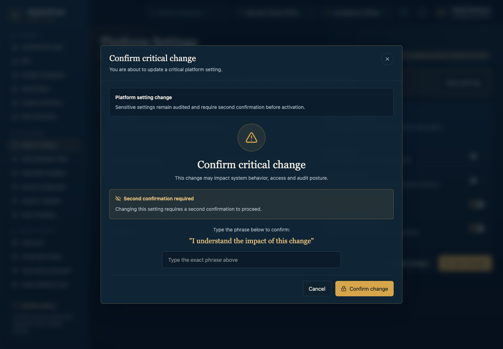

1. Go to **Platform Settings**.
2. Review the current platform setting values and check whether a second confirmation is required.
3. Review the advice-boundary policy and confirm that advice-like content still requires advisor review and compliance release.
4. Review role templates and security defaults.
5. Review evidence and export templates.
6. Confirm only changes that are allowed for your role and supported by the current demo state.

**Result:** The platform baseline is reviewed. Sensitive changes require confirmation and audit treatment.

**If you cannot continue:** Check whether you have the required platform role, whether a second confirmation is required, or whether the current screen is demonstrational rather than a persisted policy transaction.

**Current implementation note:** The source package classifies this as navigable UI with visible policy states. Broad persisted policy transactions are not claimed.

### MT-002 Create And Prepare A Client Tenant

Use this task to move a client tenant from list/create/setup into team assignment, policy selection, and invitation readiness.

**Who can do this:** Admin, Client Success, Compliance.

**Before you start:** Confirm the demo role and tenant context. Prepare the tenant name, jurisdiction, service tier, assigned advisor, analyst, compliance owner, client success owner, policy profile, and principal invitation details.

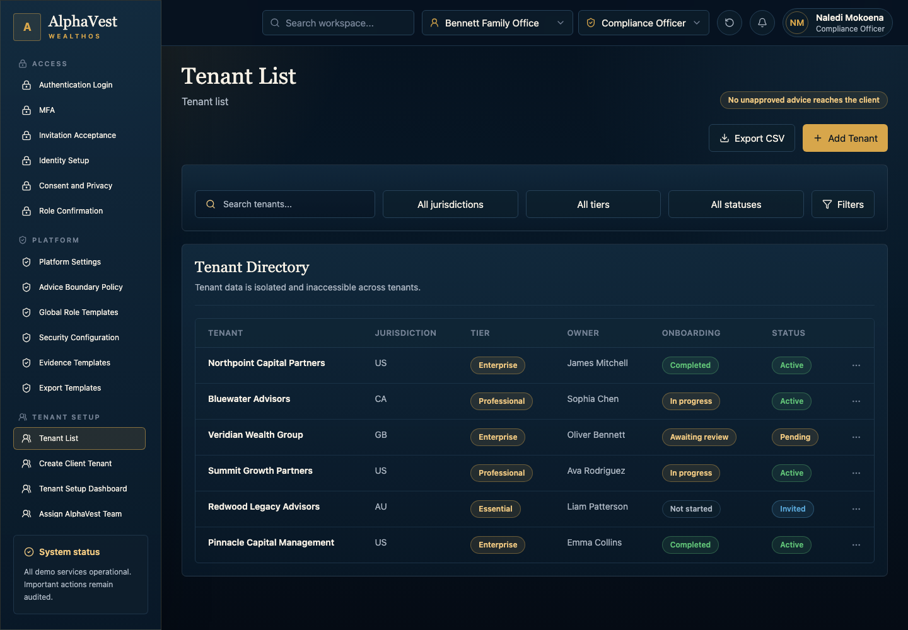

1. Go to **Tenant List**.
2. Review the existing tenant list to avoid duplicate tenant setup.
3. Start the tenant creation flow and enter the client name, jurisdiction, and service tier.
4. Assign the AlphaVest team, including advisor, analyst, compliance owner, and client success owner.
5. Review tenant policies and apply the correct profile.
6. Prepare the principal invitation only when setup gates are satisfied.

**Result:** The tenant setup checklist shows whether activation is ready or blocked.

**If you cannot continue:** Check for missing tenant details, missing compliance owner, missing team assignment, duplicate tenant data, or a blocked activation gate.

**Current implementation note:** Tenant setup is navigable. Full governed tenant write behavior remains an implementation gap.

### MT-003 Accept An Invitation And Complete Onboarding

Use this task to accept an invitation, confirm identity context, acknowledge consent, and confirm role scope.

**Who can do this:** Invited User.

**Before you start:** Use a valid demo invitation context. Real production authentication is not introduced in this demo phase.

**Required information:** Invite token, name, email confirmation, MFA method, consent version, and role acknowledgement.

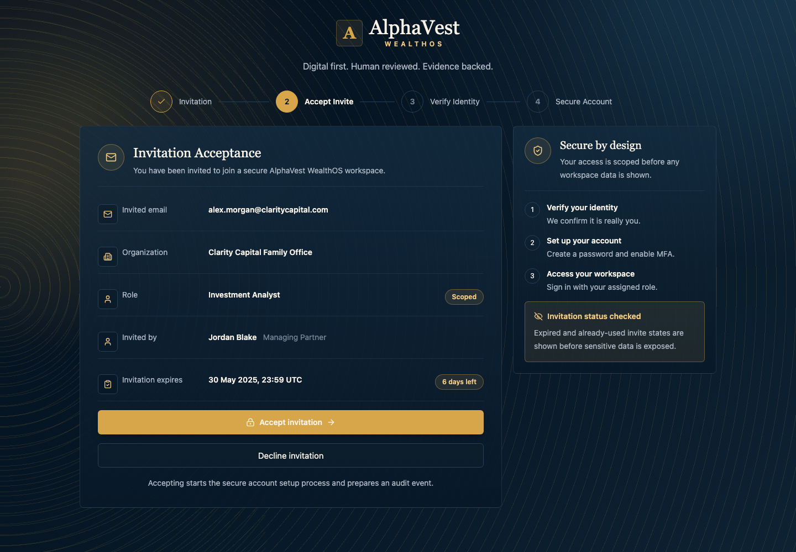

1. Go to **Invitation Acceptance**.
2. Review the invitation context and confirm that it belongs to the expected tenant.
3. Enter or confirm identity information.
4. Complete the MFA demonstration step when shown.
5. Review the privacy and consent text.
6. Select the required consent acknowledgements.
7. Confirm the role scope shown by the application.

**Result:** The user reaches role confirmation in the demo onboarding flow.

**If you cannot continue:** Check whether the invitation is missing, expired, already used, or outside the current demo tenant context.

**Current implementation note:** Onboarding screens are visual and navigable. Real authentication is intentionally deferred.

### MT-004 Submit Client Profile And Family Context

Use this task to review or enter family-office profile context, family members, and relationship structure for later workflow decisions.

**Who can do this:** Principal, Family CFO.

**Before you start:** Confirm the correct client tenant and prepare family profile, governance preferences, family member details, relationship types, ownership or beneficiary links, and missing-evidence notes.

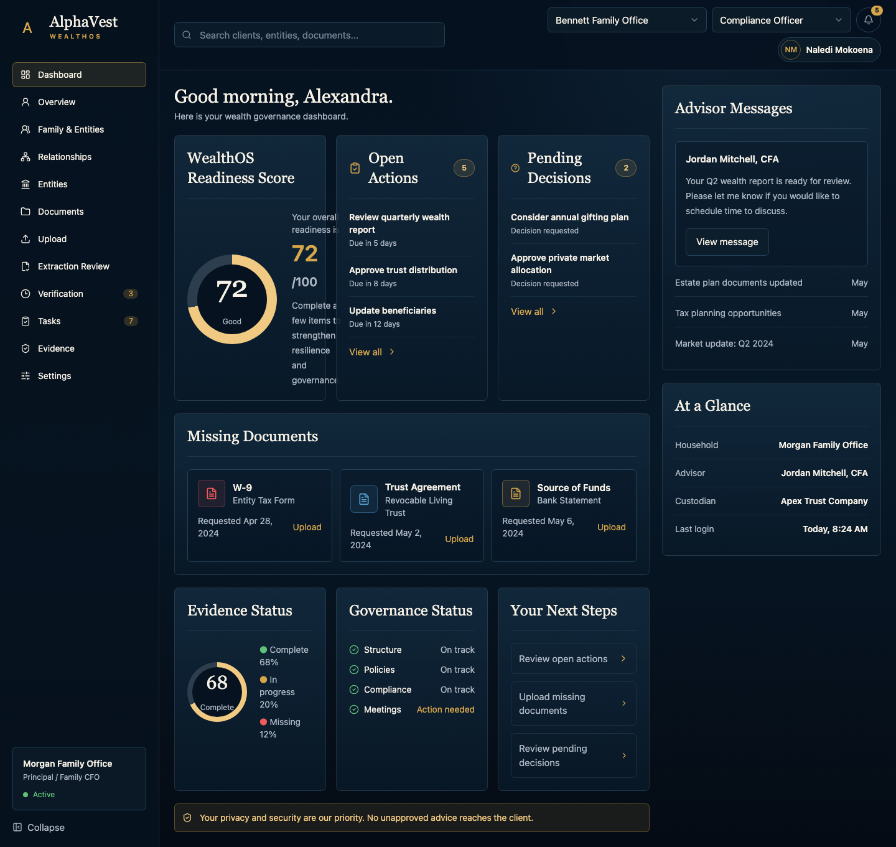

1. Go to **Client Web Dashboard**.
2. Review the visible client profile status and missing-context indicators.
3. Open the profile area and enter family profile and objective details.
4. Review family members and assign each member the correct role or scope.
5. Review relationship links and note conflicts or missing evidence.
6. Submit or leave the item for review based on the available UI state.

**Result:** Profile and relationship context is visible, with conflicts or missing evidence flagged.

**If you cannot continue:** Check the tenant, role, missing evidence indicators, and relationship conflicts.

**Current implementation note:** The UI is navigable with static/demo data. Profile persistence remains a later implementation need.

### MT-005 Create An Entity And Review Wealth Structure

Use this task to review or create legal/entity structure nodes and understand structure gaps in the wealth map and action board.

**Who can do this:** Principal, Family CFO, Analyst, Advisor.

**Before you start:** Prepare entity type, entity name, jurisdiction, participants, asset links, document evidence, action owner, and readiness state.

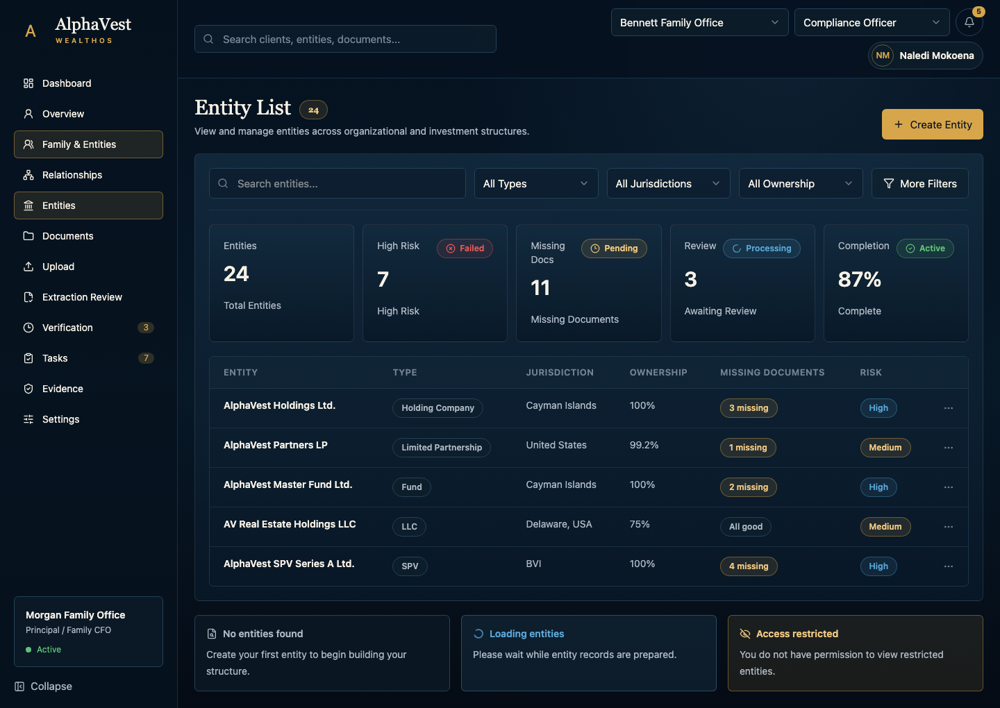

1. Go to **Entity List**.
2. Review existing entities and any missing-evidence warnings.
3. Start entity creation when your role allows it.
4. Enter entity type, name, jurisdiction, participants, and linked assets.
5. Link or request supporting document evidence.
6. Review the entity detail, wealth-map state, and action-board blockers.

**Result:** Entity detail, wealth-map context, and action-board blockers show what must happen next.

**If you cannot continue:** Check for restricted jurisdiction, missing evidence, missing participants, legal review flags, or a role restriction.

**Current implementation note:** The screens are navigable. Entity/action mutations and evidence gates still need transaction wiring.

### MT-006 Upload And Verify A Document

Use this task to upload document evidence, review extracted draft data, and move a document toward human verification.

**Who can do this:** Client, Family CFO, External Advisor, Analyst.

**Before you start:** Prepare the document file, document type, entity or asset link, sensitivity, notes, corrected extracted values, and confidence override if needed.

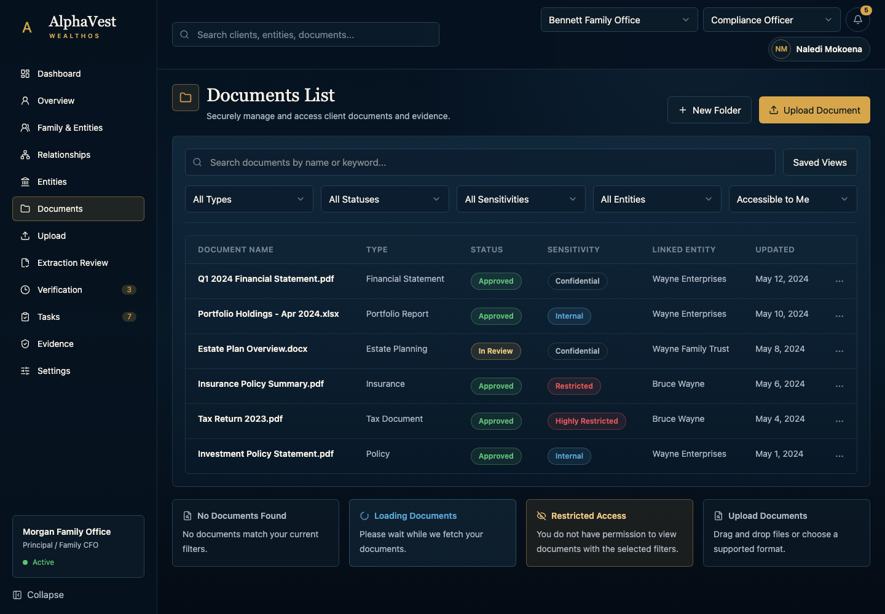

1. Go to **Documents List**.
2. Review document status and existing verification needs.
3. Start document upload when the UI allows it.
4. Select the document type and link it to the correct entity or asset context.
5. Review extracted draft values.
6. Correct low-confidence or incorrect values.
7. Submit the document for verification or clarification.

**Result:** The document reaches a verification-pending or needs-clarification state.

**If you cannot continue:** Check file type, document scope, sensitivity, missing entity links, or required corrections.

**Current implementation note:** The document workflow is navigable. Real file storage and extraction transactions are not claimed as production-complete.

### MT-007 Process A Signal And Route Internal Work

Use this task to review an internal-only signal and route it without creating client-visible advice.

**Who can do this:** Analyst.

**Before you start:** Prepare the signal ID, missing beneficial owner information, purpose of wire, source of funds, analyst note, and route decision.

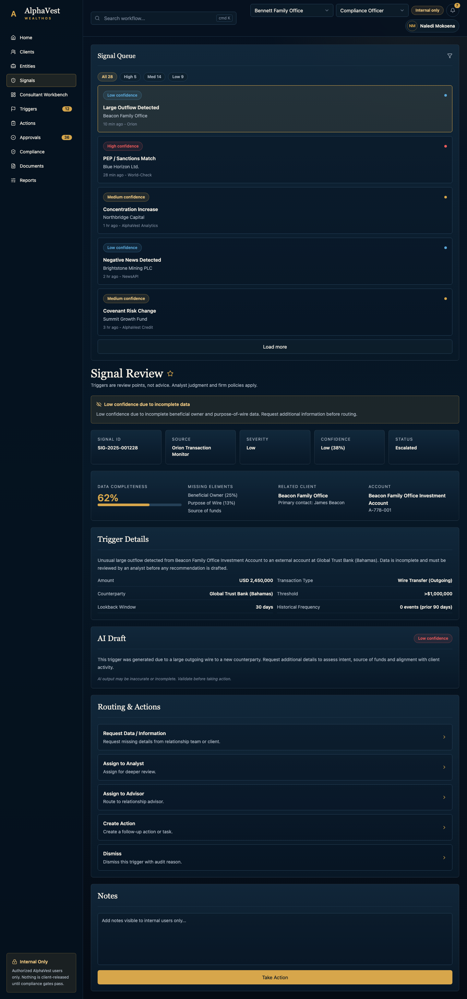

1. Go to **Signal Review**.
2. Review the signal context and its internal-only status.
3. Check missing beneficial-owner, purpose-of-wire, or source-of-funds details.
4. Add an analyst note if the UI provides the input.
5. Choose the correct route decision: request data, assign, route, or dismiss.
6. Confirm that the signal remains internal until advisor and compliance gates are satisfied.

**Result:** The trigger moves toward awaiting information or advisor review while staying internal-only.

**If you cannot continue:** Check whether evidence is missing, the signal is restricted, or the action would create client-visible advice.

**Current implementation note:** The J01 signal/advisor subset is handled on the canonical typed boundary (legacy compatibility bridge). Full typed signal governance remains a separate canonical migration target.

### MT-008 Review An Advisor Approval Package

Use this task to review an advisor package and approve, revise, request more data, or escalate without releasing it to the client.

**Who can do this:** Senior Wealth Advisor.

**Before you start:** Prepare the recommendation ID, advisor decision, rationale, conditions, and escalation reason if needed.

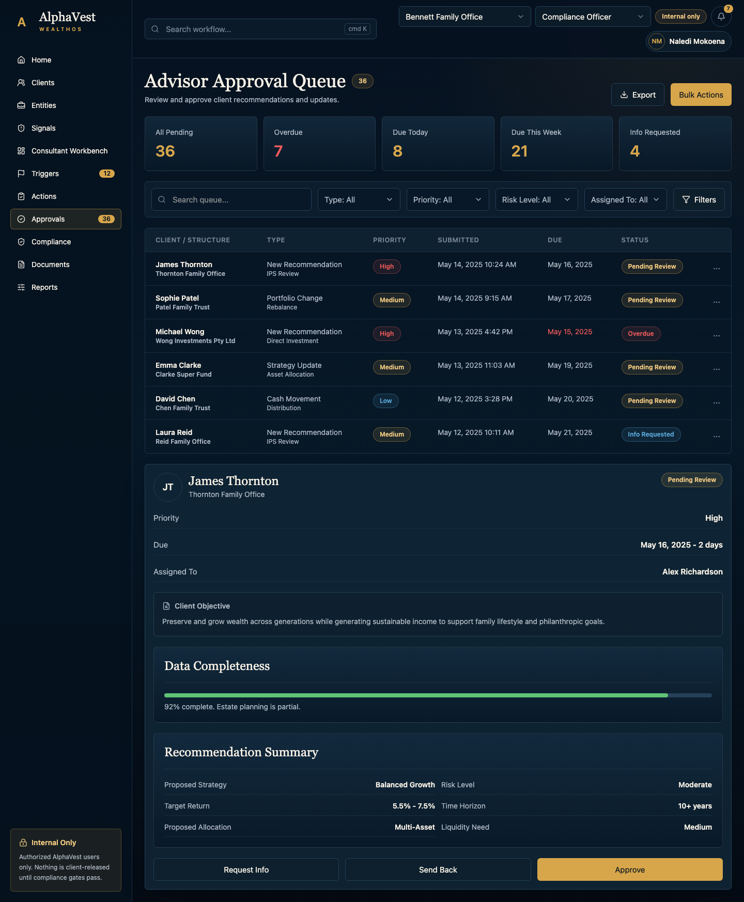

1. Go to **Advisor Approval Queue**.
2. Review the package, supporting context, and visible evidence state.
3. Open the approval detail.
4. Choose approve, revise, request more data, or escalate.
5. Enter a rationale or escalation reason when required.
6. Confirm the decision without treating it as client release.

**Result:** The advisor decision is recorded or routed. Compliance release remains required before client visibility.

**If you cannot continue:** Check missing evidence, incomplete rationale, escalation conditions, or a compliance-pending state.

**Current implementation note:** Advisor action in J01 is handled on the canonical typed boundary (legacy compatibility bridge); advisor approval remains internal and is not client visibility.

### MT-009 Release, Block, Or Request Evidence For Advice-Like Content

Use this task to decide whether advice-like content can become client-visible, must stay blocked, or needs more evidence.

**Who can do this:** Compliance Officer.

**Before you start:** Prepare classification, evidence completeness, risk disclosure check, release note, block reason, requested evidence, and owner.

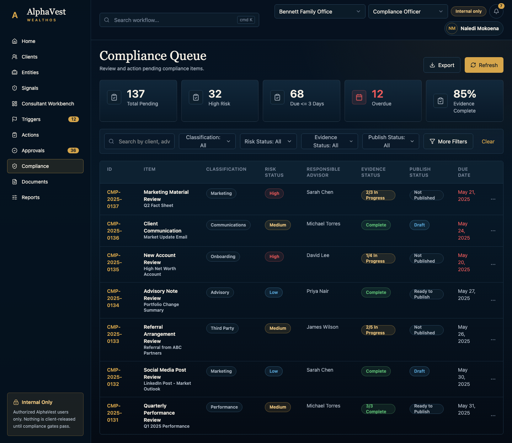

1. Go to **Compliance Queue**.
2. Review the item classification and evidence completeness.
3. Open the review detail.
4. Check the risk disclosure and permission state.
5. Choose release, block, or request evidence.
6. Enter the release note, block reason, or requested-evidence instruction.
7. Confirm only when the release gate is satisfied.

**Result:** The content is released, blocked, or returned for evidence. No unapproved advice reaches the client.

**If you cannot continue:** Check evidence completeness, advice classification, missing disclosure, permission mismatch, or release-disabled state.

**Current implementation note:** Compliance states are mixed E3/E4 demo states. Broad release transactions remain a top implementation gap.

### MT-010 Review And Submit A Released Client Decision

Use this task to review released content, choose a decision outcome, and receive a completion proof.

**Who can do this:** Principal, Family Council, scoped Trustee.

**Before you start:** Confirm that the decision is released to the client. Prepare the decision choice, participant acknowledgement, comment, or request-more-information reason.

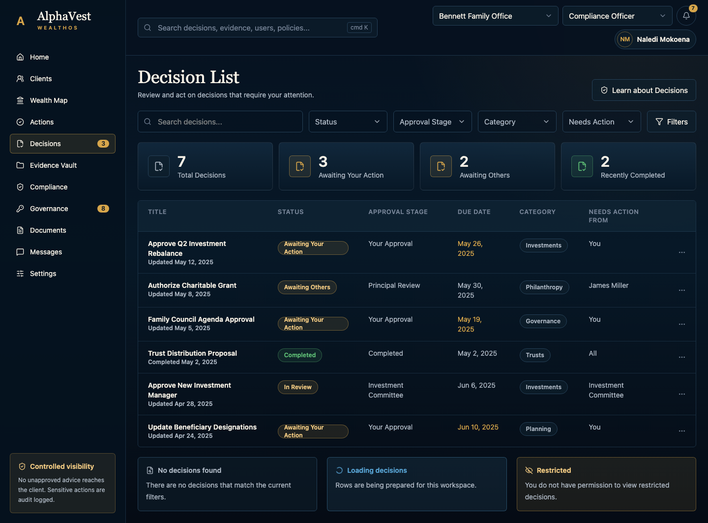

1. Go to **Decision List**.
2. Review only decisions that are visible to your role.
3. Open the decision room.
4. Review the released material, evidence state, and participant acknowledgement.
5. Choose accept, defer, reject, or request more information.
6. Add a comment when needed.
7. Submit the decision and review the success state.

**Result:** The decision success screen and linked evidence record show completion proof.

**If you cannot continue:** Check whether the item is released to the client, whether your role has scope, or whether required acknowledgement is missing.

**Current implementation note:** The UI is navigable with demo workflow actions. Final decision/evidence persistence remains incomplete.

### MT-011 Review Evidence And Create A Controlled Export

Use this task to inspect evidence and prepare a scoped, redacted, approved, audited export.

**Who can do this:** Client, Advisor, Compliance Officer, Privacy Officer.

**Before you start:** Prepare evidence search/filter terms, export type, scope items, redaction profile, recipient or share expiry, and approval reason.

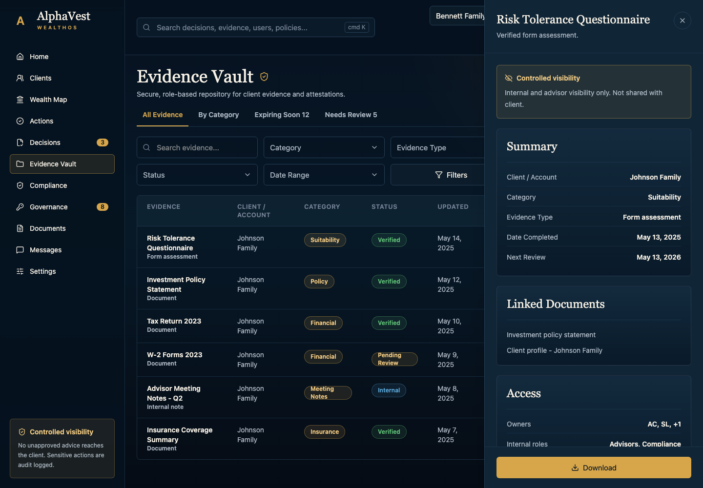

1. Go to **Evidence Vault**.
2. Search or filter for the relevant evidence record.
3. Review whether the evidence is client-visible, restricted, redacted, or internal.
4. Start a new export when your role allows it.
5. Select export scope and redaction profile.
6. Preview the export and check approval requirements.
7. Download or share only when the export is approved, scoped, redacted, and audited.

**Result:** The export package is previewed or downloaded only if scope, redaction, permission, and approval allow it.

**If you cannot continue:** Check restricted evidence, unredacted data, missing approval, expired share context, or insufficient role scope.

**Current implementation note:** Evidence and export screens are navigable. Export package/file/share realism remains a later implementation gap.

### MT-012 Manage Governance Users, Roles, And Access Requests

Use this task to invite users, change roles, approve or deny access requests, and review audit history.

**Who can do this:** Principal, Admin, Compliance, Security.

**Before you start:** Prepare user email, role, permission scope, change reason, confirmation phrase, access decision, and comment.

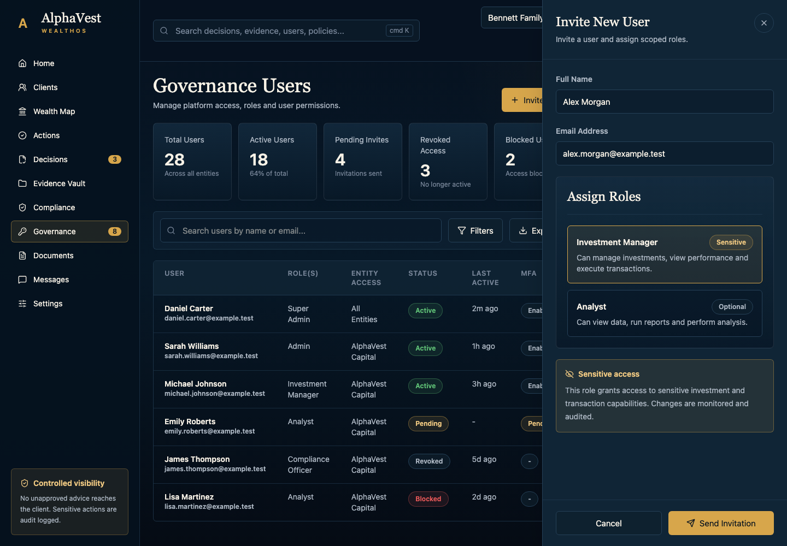

1. Go to **Governance Users**.
2. Review current users and role scope.
3. Invite a user or open a role/access request when your role allows it.
4. Select role, permission scope, and reason.
5. Complete second confirmation for sensitive changes.
6. Approve, deny, or escalate access requests.
7. Review audit history to confirm lineage.

**Result:** The access request is approved, denied, or escalated, and audit history shows the action lineage.

**If you cannot continue:** Check role scope, separation-of-duties restrictions, missing confirmation, tenant mismatch, or security review state.

**Current implementation note:** Demo actions are visible. Fully governed role/access transactions remain incomplete.

### MT-013 Choose A Communication Or Escalation Path

Use this task to choose the right secure message, data request, call, workshop, external specialist, or compliance escalation path.

**Who can do this:** Advisor, Client Success, Client.

**Before you start:** Prepare channel, recipient, message or call notes, sensitivity, escalation reason, and follow-up owner.

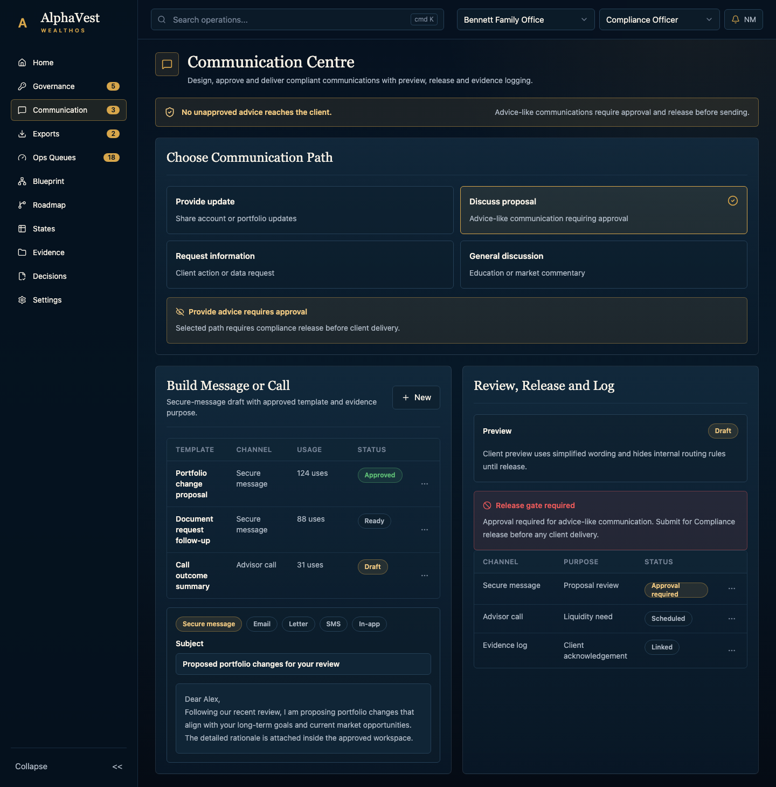

1. Go to **Communication Centre**.
2. Review the current communication or follow-up context.
3. Choose the channel that fits the complexity and sensitivity of the matter.
4. Enter message, call, or escalation notes when the UI provides the input.
5. Check whether the content is advice-like or evidence-linked.
6. Route the communication or escalation path.

**Result:** The communication path or call-trigger state is visible and can be linked to evidence when material.

**If you cannot continue:** Check sensitivity, compliance hold, missing recipient, or advice-like content that requires release control.

**Current implementation note:** Communication surfaces are mostly static. Message/call persistence is not claimed.

### MT-014 Monitor Operations, SLA, And Reference State

Use this task to review internal operations queues, SLA risk, service blueprint, roadmap scope, and state language.

**Who can do this:** Ops, Product, QA, Leads.

**Before you start:** Prepare queue filters, SLA threshold, owner, roadmap scope, or state/badge reference to inspect.

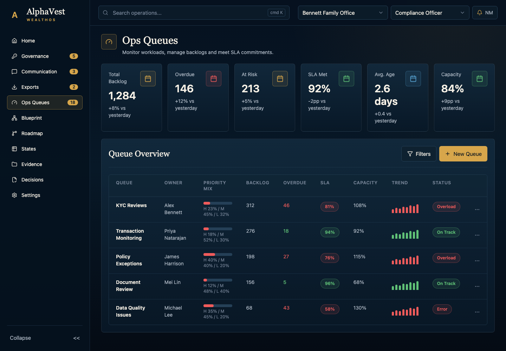

1. Go to **Ops Queues**.
2. Review queue status and bottlenecks.
3. Filter by owner, priority, SLA, or status when controls are available.
4. Review SLA and escalation indicators.
5. Use service blueprint, roadmap, and state reference pages for internal alignment.
6. Do not treat reference-only pages as client workflows.

**Result:** Bottlenecks, SLA risk, roadmap scope, and state terminology are visible for internal monitoring.

**If you cannot continue:** Check whether the screen is read-only, reference-only, or waiting for queue/SLA mutation implementation.

**Current implementation note:** These are reference and dashboard surfaces. Queue/SLA mutation is not yet implemented.

## Workflow Reference

| Workflow | Goal | Main Actor | Entry Screen | Completion Signal |
| --- | --- | --- | --- | --- |
| UF-01 / W-01 | Configure platform policy baseline. | Platform Admin / Compliance / Security | Platform Settings | Policy baseline reviewed; sensitive changes require confirmation and audit. |
| UF-02 / W-02 | Prepare a client tenant. | Admin / Client Success / Compliance | Tenant List | Tenant setup checklist shows ready or blocked activation gates. |
| UF-03 / W-03 | Complete invitation and consent onboarding. | Invited User | Invitation Acceptance | Role confirmation reached in demo onboarding. |
| UF-04 / W-04 | Maintain profile and family context. | Principal / Family CFO | Client Web Dashboard | Profile and relationship context is visible with flags. |
| UF-05 / W-05 | Review entity and wealth structure. | Principal / CFO / Analyst / Advisor | Entity List | Entity, wealth-map, and action blockers show next work. |
| UF-06 / W-06 | Upload and verify documents. | Client / CFO / External Advisor / Analyst | Documents List | Document reaches verification-pending or needs clarification. |
| UF-07 / W-07 | Review and route internal signal. | Analyst | Signal Review | Trigger remains internal and moves toward information or advisor review. |
| UF-08 / W-08 | Review advisor approval package. | Senior Wealth Advisor | Advisor Approval Queue | Advisor decision recorded; compliance still required. |
| UF-09 / W-09 | Release, block, or request evidence. | Compliance Officer | Compliance Queue | Client visibility is allowed, blocked, or deferred for evidence. |
| UF-10 / W-10 | Submit released client decision. | Principal / Family Council / Trustee scoped | Decision List | Decision success and linked evidence state are visible. |
| UF-11 / W-11 | Review evidence and export. | Client / Advisor / Compliance / Privacy | Evidence Vault | Export can proceed only if scoped, redacted, approved, and audited. |
| UF-12 / W-12 | Manage access governance. | Principal / Admin / Compliance / Security | Governance Users | Access decision and audit lineage are visible. |
| UF-13 / W-13 | Choose communication or escalation path. | Advisor / Client Success / Client | Communication Centre | Communication path or call trigger is visible. |
| UF-14 / W-14 | Monitor operations and reference states. | Ops / Product / QA / Leads | Ops Queues | Queue/SLA/reference status is visible. |

## Field And Data Reference

| Field | Task | Required | Allowed Or Expected Values | Demo Example | Important Block |
| --- | --- | --- | --- | --- | --- |
| Setting key/value | MT-001 | Yes | Known platform setting and bounded value | AlphaVest WealthOS / 7 years / 30 minutes | Second confirmation required |
| Advice classification | MT-001 | Yes | information, workflow, guidance, advice-relevant, advice, out-of-scope | advice_relevant | Cannot weaken release rule without reason |
| Client name and jurisdiction | MT-002 | Yes | Approved jurisdiction list | Northbridge Family Office / Switzerland | Duplicate or missing tenant details |
| Compliance owner | MT-002 | Yes | Users with compliance officer role | Naledi Mokoena | Activation remains blocked |
| Invite token | MT-003 | Yes | Valid active invitation | demo invite token | Invalid invitation state |
| Privacy acknowledgement | MT-003 | Yes | Active consent policy | Privacy Notice v1 accepted | Cannot continue without consent |
| Family profile and objective | MT-004 | Yes | Profile taxonomy | Morgan Family Office / Family Office Advisory | No final-advice fields |
| Family member role | MT-004 | Yes | Principal, CFO, Trustee, Beneficiary, Next Gen | Trustee | Conflict or missing relationship |
| Entity type/name/jurisdiction | MT-005 | Yes | Entity type and jurisdiction lists | trust / Sunward Trust / Switzerland | Blocked or legal review state |
| Document file/type/scope | MT-006 | Yes | Allowed file types and document taxonomy | Trust Agreement.pdf / Trust deed | Upload error or verification pending |
| Corrected extracted value | MT-006 | Conditional | Extracted payload fields | Beneficial owner: Sunward Holdings | Needs clarification |
| Analyst route decision | MT-007 | Yes | Request Data, Assign, Route, Dismiss | Request Data / Information | Must not create client advice |
| Advisor decision and rationale | MT-008 | Yes | Approve, Revise, Request More Data, Escalate | Approve with rationale | Compliance pending |
| Release/block decision | MT-009 | Yes | Release, Block, Request Evidence | Request Evidence | Release requires all gates |
| Decision choice | MT-010 | Yes | Accept, Defer, Reject, Request Info | Defer with comment | Only released decisions are shown |
| Scope and redaction profile | MT-011 | Yes | Allowed objects and redaction profiles | Client-visible evidence package | Restricted or unredacted data cannot export |
| Role/permission/scope/reason | MT-012 | Yes | Roles and permissions table | Portfolio Manager + view performance | Second confirmation required |
| Channel, recipient, sensitivity, notes | MT-013 | Yes | secure_message, phone, video, in_person | Advisor call | Advice-like content needs gate |
| Queue filter, owner, status, SLA | MT-014 | Optional | Queue and SLA taxonomy | At risk | Read-only if not implemented |

## Troubleshooting And Blocked States

| Pattern | What It Usually Means | What To Do |
| --- | --- | --- |
| Wrong role | The selected demo role cannot view or complete the action. | Confirm the role selector or ask an authorized role to complete the task. |
| Wrong tenant | The object belongs to another tenant context. | Confirm the tenant selector before continuing. |
| Missing evidence | The workflow does not have enough proof for release, decision, readiness, or export. | Upload or request the required evidence and return to the task. |
| Compliance hold | Advice-like material has not been released. | Open the compliance review or block state and follow the requested next step. |
| Export blocked | Scope, redaction, approval, permission, or expiry is not satisfied. | Review export scope and redaction profile before preview or download. |
| Static or no-op control | The demo may show a future action before persistence is implemented. | Treat the screen as demonstrational and check the implementation note. |
| Reference-only page | The page explains service, roadmap, or state language. | Use it for internal alignment, not as a client workflow. |

## Implementation Status Notes

The current manual covers all 14 source-package tasks. Verified proof currently concentrates on typed-command and compatibility-path boundaries that are explicitly surfaced, especially the J01 canonical typed boundary (legacy compatibility bridge) plus related audit/evidence behavior. Other areas are navigable and visually rich, but not all visible controls are fully persisted workflow transactions.

Use the screenshot index and traceability file when updating this manual. If a workflow becomes fully implemented, update its implementation note, evidence level, screenshot capture, and QA record together.
